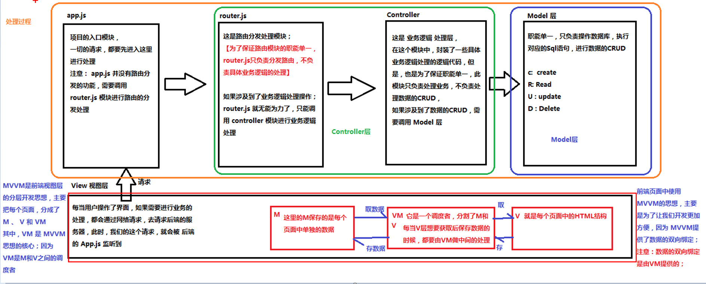
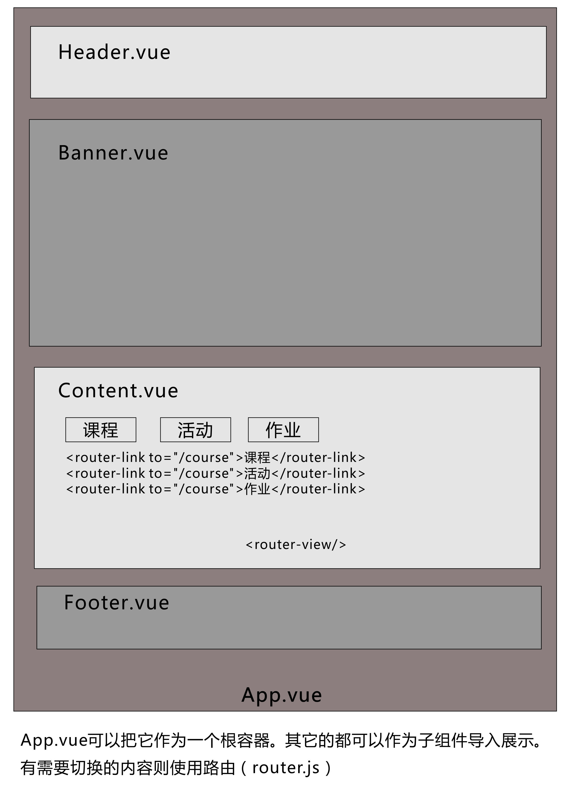
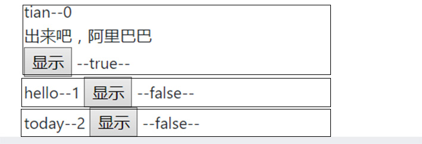
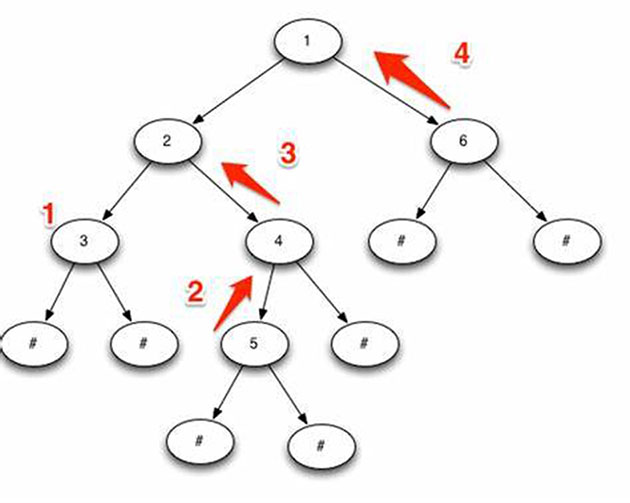

# <center>Vue.js实战笔记</center>

## 目录

- [下载与资源](#下载与资源)
- [当前版本](#当前版本)
- [MVVM图示](#mvvm图示)
- [安装Vue](#安装vue)
- [nrm的安装](#nrm的安装)
- [导入和导出js](#导入和导出js)
- [Vue基础](#vue基础)
- [BootstrapVue](#bootstrapvue)
- [页面布局图示](#页面布局图示)
- [导入子组件](#导入子组件)
- [切换组件router-link](#切换组件router-link)
- [axios](#axios)
- [父组件向子组件传值传方法](#父组件向子组件传值传方法)
- [子组件主动获取父组件数据和方法](#子组件主动获取父组件数据和方法)
- [父组件主动获取子组件数据和方法](#父组件主动获取子组件数据和方法)
- [$refs获取DOM对象和组件](#refs获取dom对象和组件)
- [vue-router基本使用](#vue-router基本使用)
- [vue-router切换时的当前路径的高亮显示](#vue-router切换时的当前路径的高亮显示)
- [vue-router路由传参](#vue-router路由传参)
- [子路由（路由嵌套）的设计](#子路由路由嵌套的设计)
- [命名视图布局](#命名视图布局)
- [命名视图的形式跳转路由](#命名视图的形式跳转路由)
- [编程式路由](#编程式路由)
- [全局权限router.beforeEach](#全局权限routerbeforeeach)
- [vuex](#vuex)
- [vue-cookies](#vue-cookies)
- [mavonEditor](#mavoneditor)
- [语言组件vue-i18n](#语言组件vue-i18n)
- [过滤器filter](#过滤器filter)
- [计算和监听事件](#计算和监听事件)
- [实时更新数据this.$set](#实时更新数据thisset)
- [实时切换显示或隐藏元素](#实时切换显示或隐藏元素)
- [实现全局公共方法](#实现全局公共方法)
- [页面加载数据之前增加loading动画](#页面加载数据之前增加loading动画)
- [页脚固定在底部](#页脚固定在底部)
- [下拉菜单](#下拉菜单)
- [拖动排序](#拖动排序)
- [西瓜播放器](#西瓜播放器)
- [video.js播放器](#videojs播放器)
- [vue的报错](#vue的报错)
- [动态检查用户名是否已存在](#动态检查用户名是否已存在)
- [手机端配置](#手机端配置)
- [路由的历史模式和哈希模式](#路由的历史模式和哈希模式)
- [递归组件展示父子回复](#递归组件展示父子回复)
- [url生成二维码](#url生成二维码)


## 下载与资源

[主站 |](https://cn.vuejs.org)
[Vue Cli |](https://cli.vuejs.org/zh/guide/installation.html)
[vue api |](https://cn.vuejs.org/v2/api/#devtools)
[Vue详细手记 |](https://juejin.im/post/5bda5102e51d45683b68be1a)
[BootstrapVue |](https://bootstrap-vue.js.org)
[mpvue(小程序) |](http://mpvue.com)
[项目布署 |](https://blog.csdn.net/zjq_1314520/article/details/80031815)
[网站图标svg |](https://ionicons.com)

## 当前版本
```
node v12.13.0 / npm 6.12.0 / cnpm@6.1.0 / @vue/cli 4.1.1

"dependencies": {
    "bootstrap": "^4.4.1",
    "bootstrap-vue": "^2.1.0",
    "core-js": "^3.4.3",
    "dsteem": "^0.11.3",
    "ipfs-http-client": "^40.1.0",
    "mavon-editor": "^2.7.7",
    "steem": "^0.7.10",
    "vue": "^2.6.10",
    "vue-cookies": "^1.6.1",
    "vue-router": "^3.1.3",
    "vuex": "^3.1.2"
  },
```

## MVVM图示


## 安装Vue
[Vue Cli](https://cli.vuejs.org/zh/guide/installation.html)
```
1.使用cnpm, 注册为国内的镜像，使用cnpm代替npm
npm install -g cnpm --registry=https://registry.npm.taobao.org  

2.cnpm install -g @vue/cli
vue --version

3.创建一个新项目
vue create hello-world

//babel router vuex 选择这三项就可以了
//sass可以不选填，它是css语法的拓展
//eslink 是检查语法的，可以不用

4. 运行
cnpm run serve

5. 打包
cnpm run build
```

## nrm的安装
```
nrm 是一个npm源管理器，允许你快速地在如下npm源间切换：
npm install nrm -g
nrm ls
nrm use taobao  //切换不同的镜像源
npm install cnpm -g   //安装cnpm工具
```

## 导入和导出js 
```js
//text.js
export default {
  name: 'tiantian',
  age: 28
}
export let title = 'every'

//main.js
import tt from './text.js'
import {title} from './text.js'

console.log(tt)   //tt.name  tt.age
```

## Vue基础
[Vue基础](./dates-win/vue-basic.md)

## BootstrapVue
[手册 |](https://bootstrap-vue.js.org/docs/)
[参考](https://juejin.im/post/5cd2c1f06fb9a031f10ca447)
```js
cnpm install bootstrap-vue bootstrap --save

//src/main.js
import BootstrapVue from 'bootstrap-vue'
import 'bootstrap/dist/css/bootstrap.css'
import 'bootstrap-vue/dist/bootstrap-vue.css'

Vue.use(BootstrapVue)
```

## 页面布局图示


## 导入子组件
主要是在 App.vue 中布局。
主要分三步：引入，注册及使用。
```js
<template>
  <div id="app">
    <Header></Header>  //3.使用
    <Banner></Banner>
  </div>
</template>

<script>
  import Banner from '@/components/Banner'  // 1.引入
  import Header from '@/components/Header'
  export default {
    name: 'App',

    data(){
      return {
       }
    },

    methods:{
      logout(){
        this.$store.commit('clearToken')
      }
      },

    components: {
      Banner,   //2.注册
      Header
    }
  }
</script>
```

## 切换组件router-link
```html
<template>
  <div id="app">
    <router-link to="/index">首页</router-link>
    <router-link to="/course">课程</router-link>
    <router-link to="/manage">管理</router-link>
    <div v-if="$store.state.token">
      <a>{{ $store.state.username }}</a>
      <a @click="logout">注销</a>
    </div>
    <div v-else >
      <router-link to="/register">注册</router-link>
      <router-link to="/login">登录</router-link>
    </div>
    <router-view/>
  </div>
</template>
```

## axios
[axios中文文档](https://www.kancloud.cn/yunye/axios/234845)
[参考](http://www.axios-js.com/zh-cn/docs)
[参考2](https://www.kancloud.cn/yunye/axios/234845)
```js
cnpm install axios --save

//main.js
import axios from 'axios'
Vue.prototype.axios = axios
//其它js中使用：
this.axios({......})
//或者是哪里使用哪里就导入：
import axios from 'axios'
axios.get(){}

注：Promise尽量使用箭头函数，没有this的问题.

methods:{
  get(){    //尽量使用箭头函数，没有this的问题
    this.axios.get('http://vue.studyit.io/api/getlunbo').then(res => {
      console.log(res.data)
    }).catch(error => {
      console.log(error)
    })
  }
}

this.axios.request({
    method: 'post',
    url: 'http://192.168.1.101:8000/login/',
    data:{
      username:this.username,
      password:this.password
    }
  })
  .then( (arg) => {
      console.log(222,arg)  
      }
  })
  .catch((error) => {
    console.log(333,error)
    })

this.axios.request({
  method:"get",
  url:'http://192.168.1.101:8000/authors/'
}).then( (arg) => {
  console.log(111,arg.data)
}).catch( (error) => {
  console.log(333,error)
})
```

## 父组件向子组件传值传方法
分两步走:
1. 在父组件中动态绑定属性，:parentmsg='msg' 
2. 子组件中通过 props:  获取。
传方法也是差不多步骤.
```html
//App.vue传值给Header.vue
//App.vue中的写法
<template>
  <div id="app">
    <Header :parentmsg="title" :func="parfun"></Header>
  </div>
</template>

<script>
  import Header from '@/components/Header'
  export default {
    name: 'App',
    data(){
      return {
        title: '父组件中的数据'
       }
    },
    methods:{
      parfun(){
        console.log('这是父方法')
      }
      },
    components: {
      Header
    }
  }
</script>

// Header.vue的写法
//在props中接受后可以直接使用
<template>
  <div>
   {{ parentmsg }}
  <button @click="func">父方法</button>
  </div>
</template>
<script>
    export default {
      name: "Header",
      props: ['parentmsg', 'func']
    }
</script>
```

## 子组件主动获取父组件数据和方法

直接在子组件中使用 this.$parent 即可获取父组件对象。
这种方法比较简单，但是不太直观，建议使用上一种方法。


## 父组件主动获取子组件数据和方法
主要是通过 $refs 获取子组件对象
 1. 绑定属性
 2. 获取子组件对象
```js
 //Test.vue
 data(){
  return {
    str:'',
    sonmsg: '这是子数据'
  }
},

// App.vue
<Test ref="sonmsg"></Test>  // 1. 绑定属性
mounted() {
  console.log(566, this.$refs.sonmsg.sonmsg) // 2. 获取子组件对象
}
```

## $refs获取DOM对象和组件
这也是调用子组件的方法
```js
<input type="button" value="调用" @click="getElement">
<h3 ref="myh3">天天这样</h3>

getElement: function () {
    console.log(this.$refs.myh3.innerText)
}

//如果是循环中使用$refs（v-for）,那么它的元素会是一个数组！
<div v-for="">
<mavon-editor v-model="body" ref="mds" @imgAdd="upimg" style="height: 100%"/>
<div>

//mds: Array(3)
0: VueComponent {_uid: 91, _isVue: true, $options: {…}, _renderProxy: Proxy, _self: VueComponent, …}
1: VueComponent {_uid: 102, _isVue: true, $options: {…}, _renderProxy: Proxy, _self: VueComponent, …}
2: VueComponent {_uid: 113, _isVue: true, $options: {…}, _renderProxy: Proxy, _self: VueComponent, …}
length: 3
```

## vue-router基本使用
[vue-router文档](https://router.vuejs.org/zh-cn)

新版的vue中路由默认就是history模式（即url中没有# ,hash模式才有）
```js
cnpm install vue-router --save

//使用，比如App.vue 
<div id="app">
    <router-link to="/login">login</router-link>
    <router-link to="/register">register</router-link>
    <router-view></router-view> 
</div>

//vouter.js
import Register from '../components/Register'
import Login from '../components/Login'
{
  path: '/register',
  name: 'register',
  component: Register
},
{
  path: '/login',
  name: 'login',
  component: Login
},

//打开新页面-如果需要打开一个新窗口，vue2版本的 <router-link> 是支持 target="_blank" 属性的
<router-link target="_blank" :to="'/searcharticle/'+'@'+post.author+'/'+post.permlink">{{ post.created }}</router-link>

<a href="https://signup.steemit.com" target="_blank">注册</a>

//直接刷新当前页面
this.$router.go(0)
```

## vue-router切换时的当前路径的高亮显示
```css
//app.vue
<style>
    //用这个类
    .router-link-exact-active{
    color:red;
    border-bottom: 1px solid red;
    }

    .router-link-active{
        color:red;
    }
</style>
```

## vue-router路由传参
```
// 一个案例：文章列表到文章详情页
//注意：+ 号之间不能有空格！！它是绑定变量的，有空格的话会被加入
<router-link :to="'/article/'+post.permlink">{{ post.title }}</router-link>
//router.js
path: '/article/:permlink'
//article.vue 取值方法
let permlink = this.$route.params.permlink

// this.$route 和 this.$router 的区别
this.$route是路由参数对象，params,query都属于它
this.$router是路由导航对象，可以实现路由的跳转
```

## 子路由（路由嵌套）的设计
```js
<div id="app">
    <router-link to="/login">login</router-link>
    <router-link to="/register">register</router-link>
    <router-view></router-view>
</div>

<template id="tmp">
    <div>
        <router-link to="/register/weibo">微博注册</router-link>
        <router-link to="/register/phone">手机注册</router-link>
        <router-view></router-view>
    </div>
</template>

var login = {
    template: '<h1>login组件</h1>'
} 
var weibo = {
    template: '<h1>weibo组件</h1>'
}
var phone = {
    template: '<h1>phone组件</h1>'
}
var register = {
    template: '#tmp'
}

var router = new VueRouter({
    routes: [
        {path: '/', redirect: '/login'},
        {path: '/login', component: login} ,
        {path: '/register', component: register,
          children: [
              {path: 'weibo',component: weibo},
              {path: 'phone',component: phone}
          ]
        }
        ]
})
```

## 命名视图布局
(name指定组件名)，多个组件布置
```js
<div id="app">
    <router-view></router-view>
    <router-view name="left"></router-view>
    <router-view name="main"></router-view>
</div>

var header= {
  template: '<h1>header组件</h1>'
}
var left = {
  template: '<h1>left组件</h1>'
}
var main = {
  template: '<h1>main组件</h1>'
}

var router = new VueRouter({
  routes: [
      {path: '/', components: {
          default: header,
              left: left,
              main: main
          }}
      ]
})
```

## 命名视图的形式跳转路由
```html
<div id="app">
    <router-link :to="{name: 'login'}">login</router-link>
    <router-link :to="{name: 'login',params:{id:10}}">login</router-link>
    //传参的形式
    <router-view></router-view> 
</div>
```

## 编程式路由
```html
<button @click='jumpto'> 点击跳转 </button>
<script>
methods: {
  jumpto (){ 
    this.$router.push('/cart')
    //this.$router.push({path: '/cart'}) 
    //this.$router.push({path: '/cart' + id}) 
  }
}
</script>
```

## 全局权限router.beforeEach
[参考](https://router.vuejs.org/zh/guide/advanced/navigation-guards.html#%E5%85%A8%E5%B1%80%E5%89%8D%E7%BD%AE%E5%AE%88%E5%8D%AB)

```js
//main.js
router.beforeEach(function (to, from, next) {
  if(to.meta.requireAuth){
    // 要去的url只有登陆成功后才能访问
    if (store.state.username) {
      next()
    } else {
      next({name: 'login'})
    }
  }else{
    next()
  }
})

//routers.js
routes: [
    {
      path: '/micro',
      name: 'micro',
      component: Micro,
      meta:{
        requireAuth:true
      }
    },
    {
      path: '/news',
      name: 'news',
      component: News,
      meta:{
        requireAuth:true
      }
    },
    {
      path: '/login',
      name: 'login',
      component: Login
    }
  ],
```

## vuex
vue配套的公共数据管理工具，它可以把一些共享的数据保存到vuex中，实现不同组件传值，并且数据持久化。

Vuex 是一个专为 Vue.js 应用程序开发的状态管理模式。小项目可以直接用H5的 localStorage 、 sessionStorage 
```js
cnpm install vuex --save

import Vuex from 'vuex'
Vue.use(Vuex)
var store = new Vuex.Store({
  state: {
    count: 0  //this.$store.state.count调用数据
  },
  mutations: {
   increment(state){
     state.count ++
   }, //this.$store.commit('increment')调用方法
   getters:  {
      optCount: function (state) {
        return state.count   //只对外提供数据，$store.getters.optCount
      }
   }
  }
})
//挂载到VM实例上
var app = new Vue({
        el: '#app',
        store
      })  

总结：
1. state中的数据，不能直接修改，如果想要修改，必须通过 mutations
2. 如果组件想要直接 从 state 上获取数据： 需要 this.$store.state.***
3. 如果 组件，想要修改数据，必须使用 mutations 提供的方法，需要通过 this.$store.commit('方法的名称'， 唯一的一个参数(可以拼成对象))
  that.$store.commit('saveUser', {username: that.username, password: privWif})
4. 如果 store 中 state 上的数据， 在对外提供的时候，需要做一层包装，那么 ，推荐使用 getters, 如果需要使用 getters ,则用 this.$store.getters.***
```

## vue-cookies
[npm手册 |](https://www.npmjs.com/package/vue-cookies)
[手册](https://blog.csdn.net/qq_35573326/article/details/82049654)
```js
cnpm install vue-cookies --save

// main.js
import Vue from 'vue'
import VueCookies from 'vue-cookies'

Vue.use(VueCookies)

// 应用
Set a cookie
this.$cookies.set(keyName, value[, expireTimes[, path[, domain[, secure]]]])   //return this

Get a cookie
this.$cookies.get(keyName)       // return value                             

Remove a cookie
this.$cookies.remove(keyName [, path [, domain]])   // return  false or true , warning： next version return this； use isKey(keyname) return true/false,please

Exist a cookie name
this.$cookies.isKey(keyName)        // return false or true

Get All cookie name
this.$cookies.keys()  // return a array

//设置案例
this.$cookies.set("user_session","25j_7Sl6xDq2Kc3ym0fmrSSk2xV2XkUkX")
   // number + d , ignore case
  .set("user_session","25j_7Sl6xDq2Kc3ym0fmrSSk2xV2XkUkX","1d")
  .set("user_session","25j_7Sl6xDq2Kc3ym0fmrSSk2xV2XkUkX","1D")
  // Base of second
  .set("user_session","25j_7Sl6xDq2Kc3ym0fmrSSk2xV2XkUkX",60 * 60 * 24)
  // input a Date, + 1day
  .set("user_session","25j_7Sl6xDq2Kc3ym0fmrSSk2xV2XkUkX", new Date(2017, 03, 12))
  // input a date string, + 1day
  .set("user_session","25j_7Sl6xDq2Kc3ym0fmrSSk2xV2XkUkX", "Sat, 13 Mar 2017 12:25:57 GMT")

//另一种写法
import Cookie from 'vue-cookies'
Cookie.set("username", userobj.username, "20min")  //分钟
Cookie.set("username", userobj.username, "1d")     //天
Cookie.get("username")
Cookie.remove('username')
```

## mavonEditor
markdown编辑器和解析器

[手册 |](https://github.com/hinesboy/mavonEditor)
[上传图片](https://github.com/hinesboy/mavonEditor/blob/master/doc/cn/upload-images.md)

```js
cnpm install mavon-editor --save

// main.js
import mavonEditor from 'mavon-editor'
import 'mavon-editor/dist/css/index.css'

Vue.use(mavonEditor)
new Vue({
    'el': '#main',
    data() {
        return { value: '' }
    }
})

//使用
<div id="main">
    <mavon-editor v-model="body" ref="md" @imgAdd="imgAdd" style="height: 100%"/>
</div>
//methods
imgAdd(pos, $file){
  // 第一步.将图片上传到服务器sm.ms.
  var formdata = new FormData();
  formdata.append('smfile', $file);
  this.axios({
    url: 'https://sm.ms/api/v2/upload',
    method: 'post',
    data: formdata,
    headers: { 'Content-Type': 'multipart/form-data' },
  }).then((url) => {
    // 第二步.将返回的url替换到文本原位置 -> 
    console.log(899, url)
    this.$refs.md.$img2Url(pos, url.data.data.url)
  })
},


//解析成html文本
<mavon-editor
  class="md"
  :value="post.body"  //绑定的变量
  :subfield = "prop.subfield"
  :defaultOpen = "prop.defaultOpen"
  :toolbarsFlag = "prop.toolbarsFlag"
  :editable="prop.editable"
  :scrollStyle="prop.scrollStyle"
  ></mavon-editor>

computed: {
  prop () {
    let data = {
      subfield: false,
      defaultOpen: 'preview',
      editable: false,
      toolbarsFlag: false,
      scrollStyle: true
    }
    return data
  }
},
```

## 语言组件vue-i18n
[手册](https://kazupon.github.io/vue-i18n/zh/)

## 过滤器filter
常见的文本格式化，只能用在插值表达式和v-bind表达式中。实质是对数据进行处理，执行了函数。
```js
<li>{{ post.created | formatTime }}</li>

filters:{
  formatTime(data){
    return data.substring(0,10)
  }
},
```

## 计算和监听事件
watch 监听事件的变化，一有变化，立刻执行！

可以监听数据的实时变化，设一个data, 一个temp，监听temp。将会有变化的数据赋值给temp，监听到变化，会立刻赋值给data。这样可以达到实时渲染数据的目的。

```html
<template>
  <div>
    ++{{ data.id }}--{{ data.body }}++
  </div>
</template>

<script>
  export default {
    name: "Testwatch",
    data() {
      return {
        data: {id:1, body:'hello'},
        temp:{},
      }
    },
    watch:{
        temp(){
          this.data = this.temp
        }
    }
  }
</script>
```

computer对于任何复杂逻辑，你都应当使用计算属性。所有的计算属性都是以函数的形式写在Vue实例内的computed选项内，最终返回计算后的结果。
```html
<div id="example">
  <p>Original message: "{{ message }}"</p>
  <p>Computed reversed message: "{{ reversedMessage }}"</p>
</div>

var vm = new Vue({
  el: '#example',
  data: {
    message: 'Hello'
  },
  computed: {
    show: function () {
    return show = true;
    },
    // 计算属性的 getter
    reversedMessage: function () {
      // `this` 指向 vm 实例
      return this.message.split('').reverse().join('')
    }
  }
})
```

## 实时更新数据this.$set
[参考 ｜](https://blog.csdn.net/weixin_41767649/article/details/82797373)
[参考2](https://juejin.im/post/5d3c7dcfe51d45572c060131)

可以动态更新data中的数据显示，也就是操作data的方法
```js
data() {
  return {
    post: {id:1, body:'hello'},
  }
},
methods:{
  addCollection() {
    this.$set(this.post, 'id', 3)  //更改id值
    this.$set(this.post, "body", "world") 
    this.$set(this.post, "child", [])  //增加一个child属性
  },
```

## 实时切换显示或隐藏元素


```html
<template>
  <div v-for="(t, key) in data">
    {{ t.name }}--{{ key}}
      <div v-show="flag[key]">出来吧，阿里巴巴</div>
      <button @click="show(key)">显示</button>
  </div>  
</template>

<script>
    export default {
        name: "Test",
      data(){
          return {
            data:[{name:'tian', age:20},
                   {name:'hello', age:30},
                   {name:'today', age:50}
                   ],
            flag:[],
          }
      },
      methods:{
          show(key){
            //因为是下标的形式，数据不会实时渲染！
            //要使用this.$set的形式来修改它的值，这样就可以实时渲染，以实现切换的效果了。
            this.$set(this.flag, key, !this.flag[key])
            for(let i=0;i<this.data.length;i++){
              //将其它的隐藏掉
              if(key != i){
                this.$set(this.flag, i, false)
              }
          }
      },
      mounted() {
        for(let i=0; i<this.data.length;i++){
          this.flag[i] = false
        }
      }
    }
</script>
```

## 实现全局公共方法
对于常用的重复使用的代码，可以把它写成公共方法，然后在全局使用即可
主要有两步:
1.utils -> 定义方法或变量，export
2.main.js中导入并挂载到全局。
```js
//utils/getstr.js
const getstr = function(){
  function randomString(length, chars) {
    let result = ''
    for (let i = length; i > 0; --i) result += chars[Math.floor(Math.random() * chars.length)]
    return result
  }
  return randomString(5, '0123456789abcdefghijklmnopqrstuvwxyz')
}
export {getstr}

//main.js
import {getstr} from "./utils/getstr"
Vue.prototype.getstr = getstr

全局即可使用：this.getstr
```

## 页面加载数据之前增加loading动画
[参考](https://www.jianshu.com/p/104bbb01b222)
```html
1. loading.vue组件
  <template>
    <div class="loading"></div>
  </template>

  <script>
      export default {
          name: "Loading"
      }
  </script>

  <style scoped>
    .loading {
      margin: 0 auto;
      background: url('../../static/images/loading.gif') center center no-repeat #fff;
      width: 50vw;
      height: 50vh;
      z-index: 1000;
    }
  </style>

2. App.vue 全局的css
  .fade-enter,
    .fade-leave-active {
      opacity: 0;
    }
    .fade-enter-active,
    .fade-leave-active {
      transition: opacity 0.5s;
    }
    

3. 在组件中引用
<template>
  <!--加载动画-->
  <transition name="fade">
    <loading v-if="isLoading"></loading>
  </transition>
</template>

<script>
import Loading from './Loading'
export default {
  name: "Feed",
  data(){
      return{
        isLoading: true
      }
  },
  methods:{
    loadPageData: function() {
      // axios 请求页面数据 .then 中将状态值修改this.isLoading = false
      this.isLoading = false
    }
  },
  components: {
    Loading
  },
  mounted() {
    this.loadPageData()
  },
</script>
```

## 页脚固定在底部
[完美解决HTML中footer保持在页面底部问题](https://blog.csdn.net/m0_38099607/article/details/71598423)
```css
//App.vue
  html,body{
    height: 100%;
  }
  #app{
    position:relative;
    width:100%;
    min-height:100%;
    padding-bottom: 4rem;
    box-sizing: border-box;
  }

//footer.vue
.myfooter{
    background-color: rgba(228,231,233,0.75);
    color: rgba(55,53,58,0.75);
    width: 100%;
    height: 4rem;
    padding-top: 1rem;
    padding-left: 3rem;
    padding-right: 3rem;
    position:absolute;
    bottom:0px;
  }
```

## 下拉菜单
```html
<div v-if="$store.state.username">
  <div id="drop">
    <b-dropdown id="dropdown-grouped" :text="$store.state.username" class="m-2">
      <b-dropdown-item-button @click="comments">
        评论
      </b-dropdown-item-button>
      <b-dropdown-divider></b-dropdown-divider>
      <b-dropdown-item-button @click="reply">
        回复
      </b-dropdown-item-button>
      <b-dropdown-divider></b-dropdown-divider>
      <b-dropdown-item-button @click="logout">
        注销
      </b-dropdown-item-button>
    </b-dropdown>
  </div>
</div>
```

## 拖动排序
[Vue.Draggable拖拽功能的配置和使用方法 |](https://blog.csdn.net/lfcss/article/details/81353727)
[github](https://github.com/SortableJS/Vue.Draggable)


## 西瓜播放器
[设置](http://h5player.bytedance.com/en/config/#required-configuration)
```
cnpm install xgplayer --save
cnpm install xgplayer-mp4 --save 

<div id="vs"></div>

import Player from 'xgplayer';

const player = new Player({
    id: 'vs',
    url: 'http://s2.pstatp.com/cdn/expire-1-M/byted-player-videos/1.0.0/xgplayer-demo.mp4'
})
```

## video.js播放器
[文档 ｜](https://docs.videojs.com/#)
[中文文档 ｜](https://blog.csdn.net/a0405221/article/details/80923090)
[推流 ｜](https://blog.csdn.net/little__SuperMan/article/details/89071764)
```
npm install --save-dev video.js
npm install video.js@next
```


## vue的报错
[参考](https://segmentfault.com/a/1190000014542373)
```
Vue.config.productionTip = false
Vue.config.devtools = true

Vue.config.devtools = true

//devtools可以通过开发环境配置
Vue.config.devTools = process.env.NODE_ENV !== 'production'


start = "2020-01-06T01:59:45"
```

## 动态检查用户名是否已存在
主要是使用@keyup的动态事件，键盘一输入，就执行检查函数，以得到结果。
动态绑定样式表，将得到的结果切换显示。主要用于注册等操作。
```js
<b-input
id="inline-form-input-name"
:class="checkFlag ? 'isok': 'isfalse'"
placeholder="请输入用户名(3位以上英文 或 英文加数字)"
v-model="username"
@keyup="checkuser"
></b-input>

data() {
  return {
    username:'',
    checkFlag: true,
  }
},

checkuser(){
  let that = this
  const username = this.username
  if(username.length < 3){
    return this.checkFlag=false
  }
  async function main(){
    const ac = await that.client.database.call('lookup_account_names', [[username]])
    // return (ac[0] === null) ? true : false;
    console.log(123, ac[0])
    if(ac[0] !== null){
      console.log("1111, 用户名已存在！")
      that.checkFlag = false
    }else{
      console.log(234567, '开始注册')
      that.checkFlag = true
    }
  }
  main()
},

<style scoped>
  .isok{
    margin-top: 1.5rem;
    width: 50%;
    /*background-color: chartreuse;*/
  }
  .isfalse{
    margin-top: 1.5rem;
    width: 50%;
    background-color: crimson;
  }
</style>
```

## 手机端配置
它会自动判断是不是手机端，如果是，则使用以下样式！
```css
@media only screen and (max-width:768px) {
  #moochain{
      width: 96%;
      margin: 0 auto;
  }
  .classlist{
      padding-left: 0.5rem;
      width: 98%;
      margin: 0 auto;
  }

}
```

## 路由的历史模式和哈希模式
[刷新页面的问题](http://www.fly63.com/article/detial/1139)
```js
//router.js
const router = new VueRouter({
  mode: 'hash',
  // mode: 'history',
  base: process.env.BASE_URL,
  routes
})
export default router

历史模式(history)的路径比较好看，比如：https://steemjiang.com/hotarticle/6725b
但是，会碰到刷新就404的错误！这个可以在nginx的配置中设置：
location / {
		root   /home/dist-steemjiang;		
		index  index.html index.htm;		
     if (!-e $request_filename) {   #history模式的设置	
 		 rewrite ^/(.*) /index.html last;
		  break;
		}
	}

哈希模式(hash), 路径中有'#',比如：https://starnote.github.io/#/starnote/7s4b6 
它无需任何额外的配置，所以，在github中可以直接使用！
```


## 递归组件展示父子回复
将递归类的数据递归展示出来，比如回复和子回复

[递归获取评论并递归展示 |](https://steemjiang.com/article/338vu)
[vue递归组件](https://www.jianshu.com/p/84eb67487113)


```html
需要主组件和递归组件两个组件来完成
//主组件 Reply.vue
<template>
  <div class="reply">
    <div v-for="item in replies">
        <Replylist :parentmsg="item"></Replylist>
    </div>
  </div>
</template>

<script>
import Replylist from './Replylist'
export default {
  name: "Reply",
  data(){
    return {
      replies:[],
    }
  },
  components: {
    Replylist
  }
}
</script>

//递归组件 Replylist.vue
<template>
  <div class="item">
    @{{ parentmsg.author}}　{{ parentmsg.body}}
    <ul v-if="parentmsg.child" class="child">
      <Replylist v-for="(item,index) in parentmsg.child" :parentmsg="item" :key="index"></Replylist>
    </ul>
  </div>
</template>
<script>
  export default {
    name: "Replylist",
    props: ['parentmsg']
  }
</script>
```

## url生成二维码
[草料二维码](https://cli.im/)